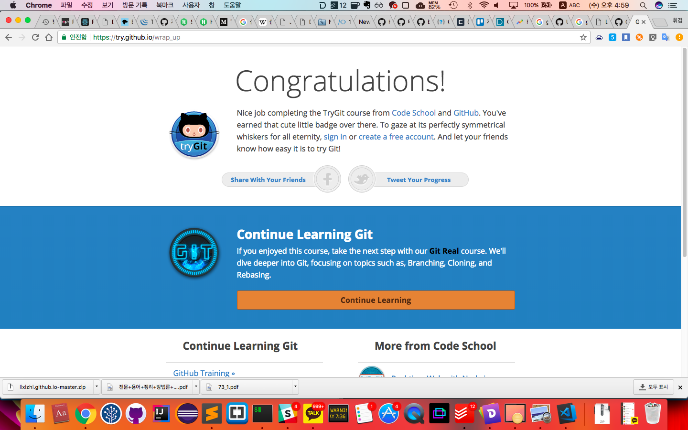

## 20180115(월)

## 20180110(수)
1. dev 폴더
   - 다시 레포 다시 만들기  TIL / 블로그
2. try. github.io
   - 웹브라우저에서 github 을 체험 
   - 마지막 스크린샷 을 강사님께 보내드리기

## 20180111(목)  
8commit, 1push, 1merge
- 팀메이트 중 한 명의 레포에 다른 한 명이 fork 를 뜬다.
- 각자의 branch 에서 각자의 파일을 만들거나 수정 기록 적기
- readme.md 파일은 공용 파일!!
- 1 시간에 한 번씩 add, commit!
- 8 시간  push